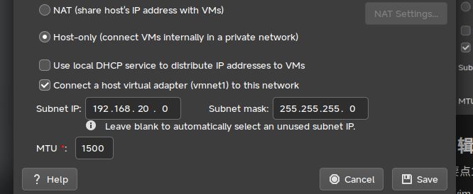

title: CentOS DHCP服务配置记录
cover: /img/posts/tux.svg
date: 2025-2-27 11:59:00
tags: [CentOS,Shell,Linux]
categories: [Linux]
-------------------
<style>
        *{
                user-select: none;
        }
</style>
# 一、环境准备
主机配置

| 网卡 | 属性 | IP |
| --- | --- | --- |
| vmnet8 | NAT | 192.168.50.1 |
| vmnet1 | HOST Only | none |
| WWAN | DHCP | 10.7.126.8 |

虚拟服务器配置

| 网卡 | 属性 | IP | 与主机连接 |
| --- | --- | --- | --- |
| ens33 | DHCP | 192.168.50.128 | vmnet8 |
| ens36 | static | 192.168.20.2 | vmnet1 |

虚拟主机配置

| 网卡 | 属性 | IP | 与主机连接 |
| --- | --- | --- | --- |
| ens33 | DHCP | 192.168.50.128 | vmnet8 |
| ens36 | DHCP | 192.168.20.10 | vmnet1 |

## 1.修改虚拟网卡的设置,关闭原有DHCP服务

步骤要点:打开虚拟网络编辑器,将其关闭



# 二、虚拟服务器需要做的事情

## 1.编辑网卡配置

步骤要点1：将HOST Only网卡设置中的BOOTPROTO的属性值修改为static

步骤命令：sudo vim /etc/sysconfig/network-scripts/ifcfg-ens36


步骤要点2：为网卡添加一个IP地址、网关、和子网掩码


修改完成的ifcfg-ens36文件内容

```
HWADDR=00:0C:29:9C:BE:67
TYPE=Ethernet
PROXY_METHOD=none
BROWSER_ONLY=no
BOOTPROTO=static
DEFROUTE=yes
IPV4_FAILURE_FATAL=no
IPV6INIT=yes
IPV6_AUTOCONF=yes
IPV6_DEFROUTE=yes
IPV6_FAILURE_FATAL=no
IPV6_ADDR_GEN_MODE=stable-privacy
NAME=ens36
DEVICE=ens36
UUID=a9743b5f-1be0-3ca9-a875-29cb86741dc3
ONBOOT=yes
AUTOCONNECT_PRIORITY=-999
IPADDR=192.168.20.2
NETMASK=255.255.255.0
PREFIX=24
GATEWAY=192.168.20.1

```

## 2.安装dhcp软件包

步骤命令：sudo yum install dhcp


## 3、编辑dhcp配置文件

步骤命令：sudo vim /etc/dhcp/dhcpd.conf

步骤要点：全是要点


修改好的dhcpd.conf文件内容:

```
subnet 192.168.20.0 netmask 255.255.255.0
{
        range 192.168.20.10 192.168.20.100;
        option routers 192.168.20.2;
        option broadcast-address 192.168.20.255;
        default-lease-time 7200;
        max-lease-time infinite;
}          
```

## 4、启动dhcpd服务

步骤命令：sudo systemctl start dhcpd


# 二、客户端需要做的事情

## 1、查看虚拟客户机获取到的地址

步骤命令：ifconfig | grep inet && ifconfig

看到虚拟客户机的HOST Only网卡(ens36)成功获取到IP地址


## 2、检查客户机当前IP的来源：

步骤命令：sudo dhclient -v ens36

可以看到DHCP服务器在192.168.20.1


<span style="color: rgba(0,0,0,0)">这篇文章是由Siralop写的</span>
